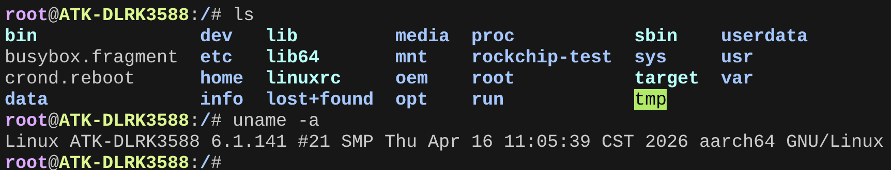
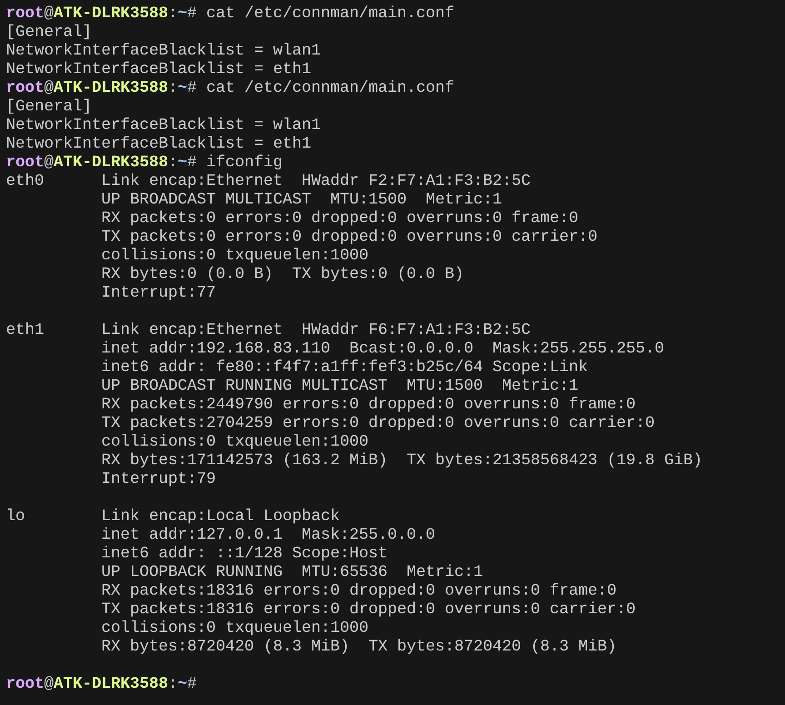
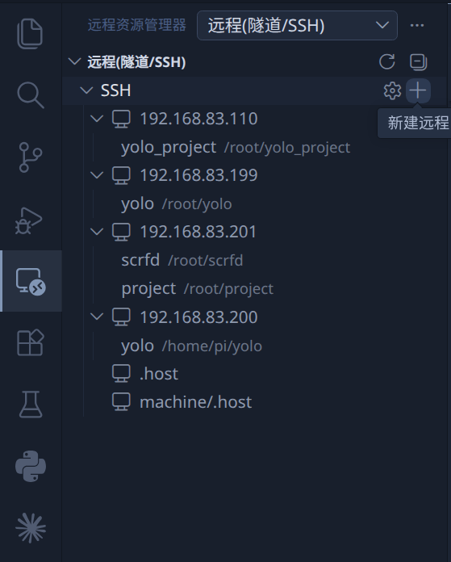
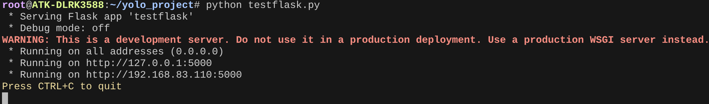
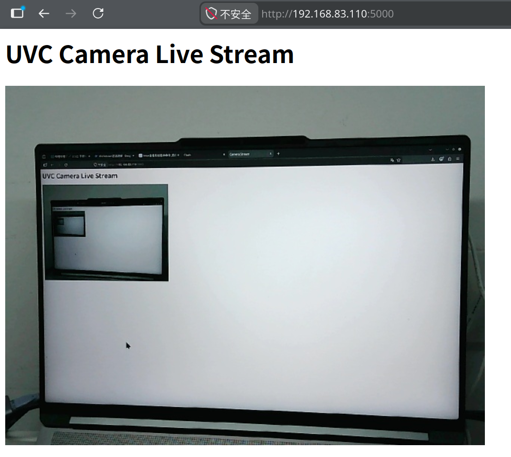
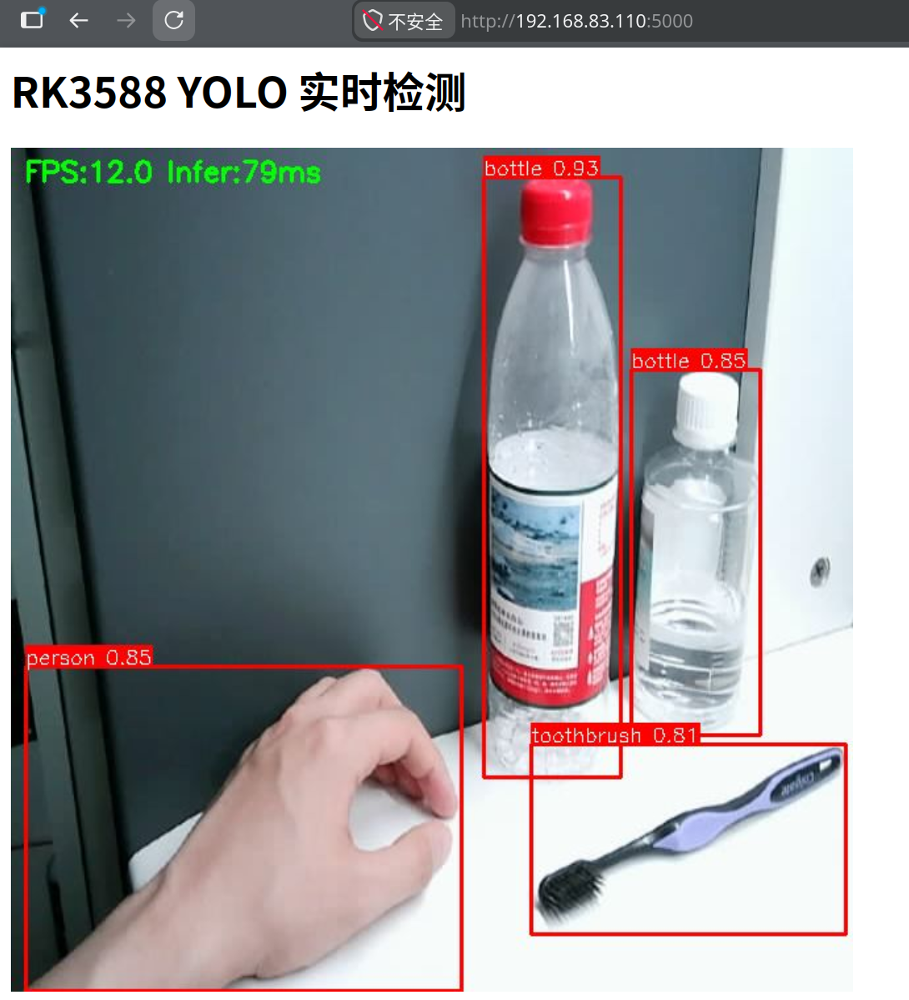
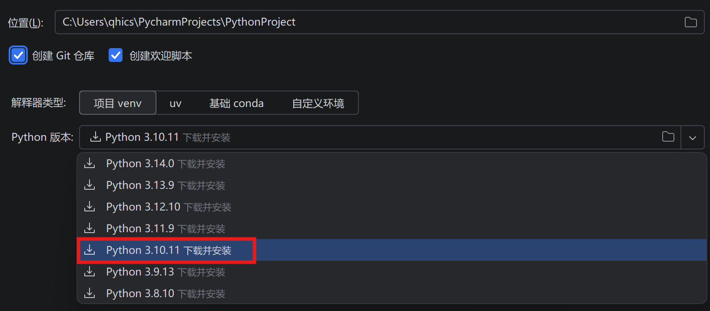
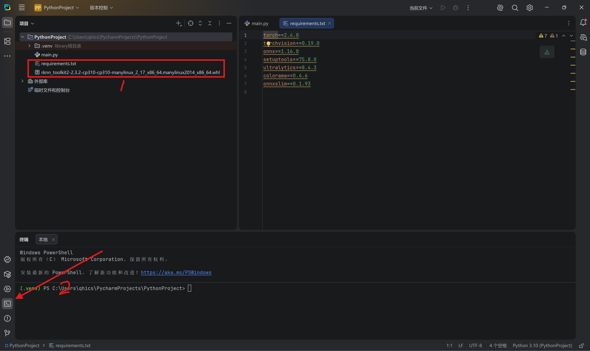
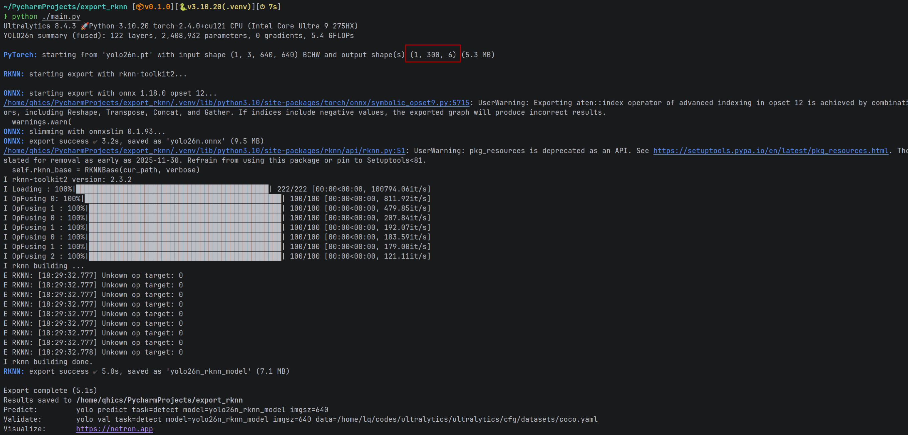

# rk3588-yolo-flask-demo

以下实验步骤针对正点原子 ATK-DLRK3588 开发板出厂 Buildroot 系统，完整资料请从官网下载：
本教程基于正点原子出厂buildroot系统新版系统镜像，下载地址https://pan.baidu.com/s/15VAiczqrIOPNAQt8cZOKPw?pwd=lnbq 

完整新版资料

    开发板资料链接：
    （A盘:基础资料） https://pan.baidu.com/s/1M5BEFhBA16YLfQr8rKEw6A 提取码：bxzv
    （B盘:SDK源码与虚拟机链接） https://pan.baidu.com/s/1vQEGoP6QYdSGPKDZx8yXCA 提取码：gq0n

# 一、板端环境配置

    http://www.openedv.com/docs/boards/arm-linux/RK3588Linux.html
### 1、串口终端连接
在windows上安装 CH340 驱动程序(linux系统自带不用额外安装)。
    使用 USB 数据线连接开发板的 USB-UART 接口（该接口自带 CH340 USB 转串口芯片）。
    在电脑上安装 MobaXterm 或 Tabby 等终端软件（不建议使用 XCOM 等传统串口调试工具）。
    连接对应的 COM 口即可进入终端环境。
    ==系统默认使用 root 账户登录，意味着你执行的每条命令都相当于自带 sudo 权限，请务必谨慎操作！==

### 2、网络环境配置

本实验仅需在局域网内互传文件即可。调试开发板时通常使用电脑直连的无 DHCP 服务环境，开发板无法自动获取 IP 地址，需要手动配置。
为电脑和开发板配置相同网段的局域网地址，确保可以互相 ping 通。
开发板配置静态 IP 的步骤请参考：

    【正点原子】ATK-DLRK3588 开发板网盘 A 盘 → 10、用户手册 → 03、辅助文档 →【正点原子】基于 Buildroot 系统设置静态 IP 参考手册 V1.0.pdf

⚠️ 配置步骤稍有特殊，请务必阅读文档操作，不要直接询问 AI。

### 3、SSH 与 SFTP 连接

开发板默认开启 SSH 和 SFTP 服务，用户名和密码均为 root，可直接通过 SSH 登录终端或使用 SFTP 互传文件。

    ssh root@<开发板IP>

若网络配置失败使用串口终端和adb发送文件也是可行方案具体参考
正点原子】ATK-DLRK3588开发板网盘A盘-基础资料（2024）→ 10、用户手册 → 03、辅助文档 → 25【正点原子】adb工具使用说明V1.0.pdf

### 4、VS Code Remote SSH（可选）

在电脑上安装 Visual Studio Code 的 Remote SSH 插件，输入 root@<开发板IP> 进行连接。
首次连接时会自动在开发板上安装一个轻量的 VS Code 后端，提供方便的远程代码编辑服务。此步骤为可选项，但强烈推荐。

### 5、Python 环境配置

开发板自带 Python 3.10 或 Python 3.11 环境。Buildroot 系统的基础服务一般不依赖 Python，因此可以直接安装到系统环境中。
将准备好的 Python 库离线安装包拷贝到开发板，进入对应目录后执行以下命令之一：
    # 安装当前目录下的所有 .whl 包

    _pip install ./*.whl* _
    # 或安装指定的某个包
    pip install <包名>.whl

### 6、摄像头配置

本实验选用 UVC（USB Video Class）摄像头，它使用 Linux 标准驱动，兼容服务器、个人电脑及各类嵌入式设备。
UVC 摄像头会提供两个设备节点：视频捕获节点和元数据节点。使用以下命令确认视频捕获节点的名称：
    
    v4l2-ctl --list-devices

⚠️ 该命令可能因开发板上大量虚拟 V4L2 节点冲突而执行失败。根据实际测试，旧版系统摄像头节点通常为 /dev/video41，新版系统通常为 /dev/video-usbcamera0。

### 7、网页推流与验证

网页推流采用 B/S 架构，兼容局域网内任何能使用浏览器的设备访问。
将测试程序拷贝到开发板，填入当前摄像头的视频捕获节点名称。
这段程序会自动捕获摄像头图像并进行jpeg编码再以http协议推流到5000端口
把我提供的testenv工程文件夹发送到开发板上的用户目录打开文件夹并运行

    python testflask.py

在浏览器中访问 http://<开发板IP>:5000，应能看到实时视频推流的摄像头画面。

### 8、推理环境验证

在工程中运行

    python end2end_flask.py

这段程序会加载我导出的yolo26n模型，实时推理并推流
若正常运行则板端环境全部部署完成。

# 一、电脑端环境配置

来自官方仓库

    https://github.com/airockchip/rknn-toolkit2.git

rknn-toolkit2工具链只支持python环境，也就是模型转换只能依赖Linux环境，模型训练可以使用其他环境。
请准备Linux虚拟机/wsl/Linux物理机其中之一
使用wsl/Linux物理机并使用非50系显卡可以直接在这个环境训练模型，否则推荐在自己最舒适的环境另外配置最新环境用于训练

### 1、安装python或pycharm

推荐使用pycharm，它会自动处理大部分虚拟环境和依赖关系。
作为学生或开源贡献者可以轻松申请免费pycharm pro，即使没有在安装后也可以免费试用30天
申请pycharm使用需要使用教育邮箱，作为北京信息科技大学在校学生可以登录
    
    https://mail.bistu.edu.cn/

注册邮箱，然后在JetBrains官网申请教育许可

    https://www.jetbrains.com/shop/eform/students

如果不使用pycharm可以安装独立python或conda环境，具体过程不多赘述。

### 2、创建虚拟环境

打开pycharm，新建工程，选中python 3.10版本，新建工程并自动创建虚拟环境

此处一定要使用虚拟环境！
若不使用pycharm则必须在命令行手动创建虚拟环境

    python -m venv .venv
    或
    /path/to/pytho310 -m venv .venv
    或
    conda create -n myvenv python=3.10

并激活

    source .venv/bin/activate
    conda activate myenv

### 3、安装必要依赖

打开终端环境

将rknn-toolkit python库安装包和pypi依赖列表拷贝到当前工程目录，打开终端环境依次输入

    pip install rknn_toolkit2-2.3.2-cp310-cp310-manylinux_2_17_x86_64.manylinux2014_x86_64.whl
    pip install -r requirements.txt

之后尝试到处官方yolo26模型

    from ultralytics import YOLO

    model = YOLO('yolo26n.pt')
    model.export(
        format='rknn',
        imgsz=640,
        name='rk3588',
        task='detect',
        opset=12,
    )

我的推理显示代码是不包含后处理的，要使用我的代码测试请确保导出的是包含后处理的yolo26模型，输出格式是(1, 300, 6)。
有几个算子目前不受rknpu支持，运行时会临时使用cpu计算这些节点。

把导出的yolo26n-rk3588.rknn模型和metadata.yaml导入开发板上替换原本文件，再次运行

    python testruntime.py

应该能实现和之前相同的效果

至此电脑端模型转换环境全部部署完成

# 三、完善项目

### 1、其他显示后端和其他模型
除测试代码外还有flask显示后端、weston显示后端（需有板端原生显示器），端到端输出模型、grid原始输出模型任意组合代码，以及包含所有可以在开头任意配置的代码
